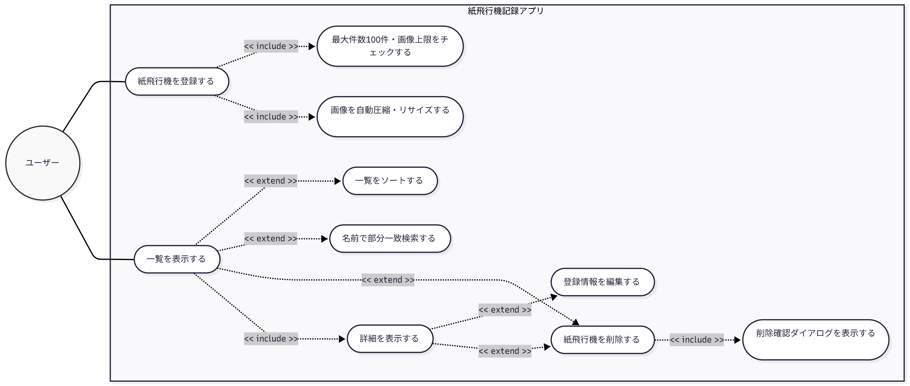
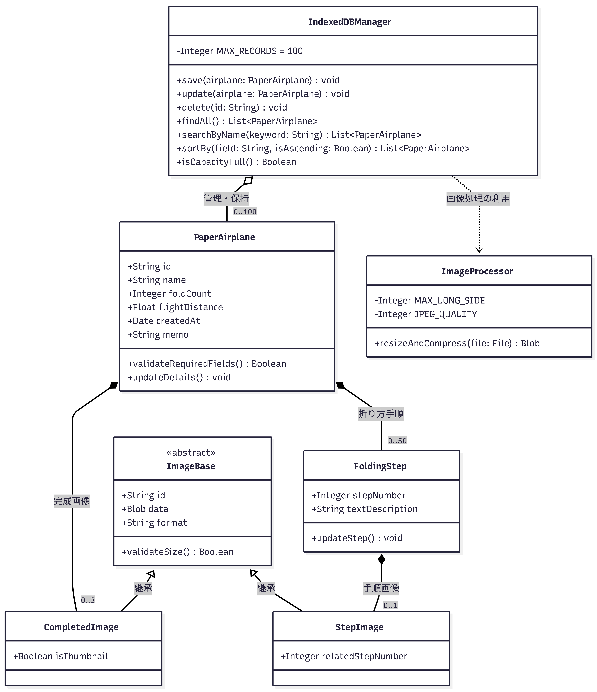
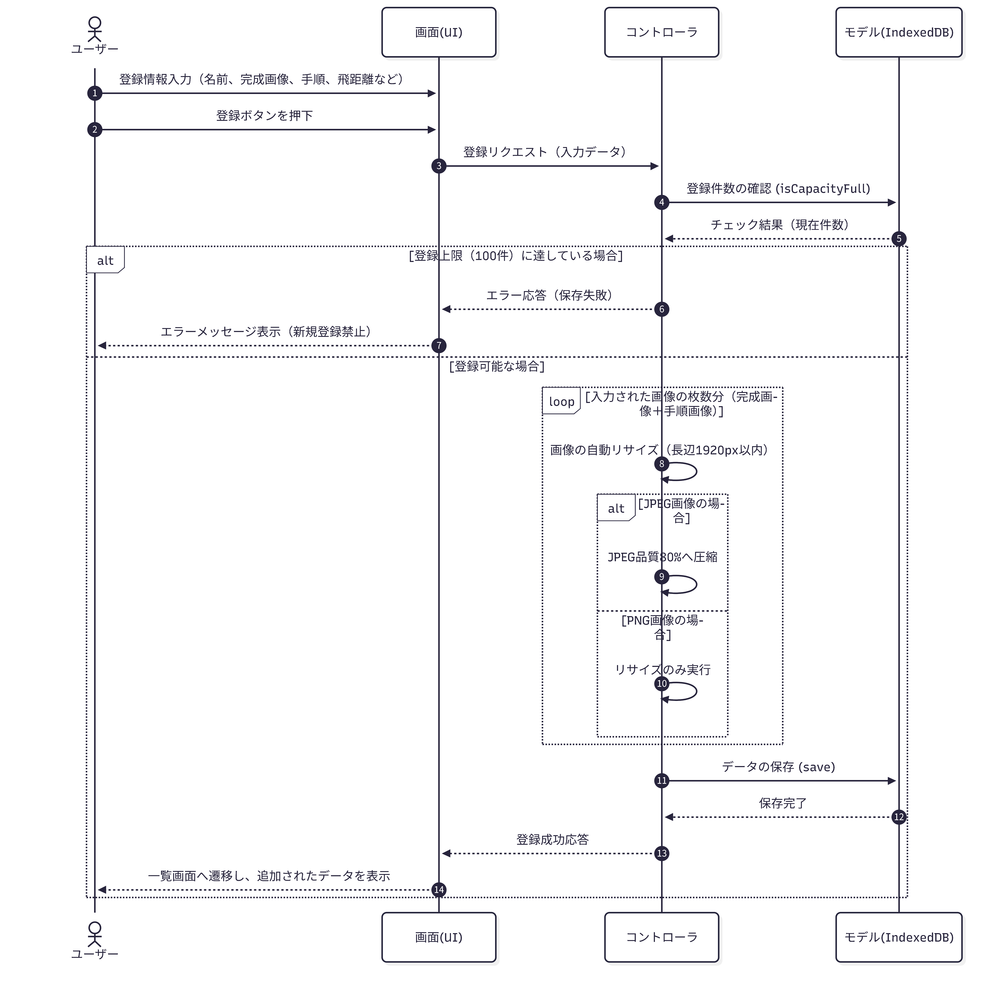
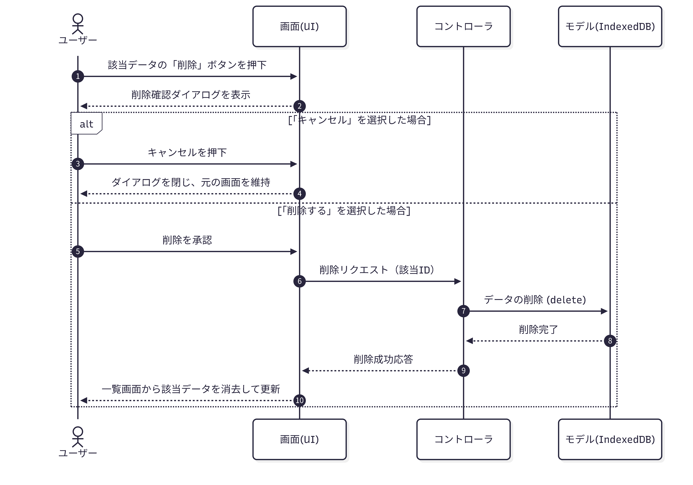
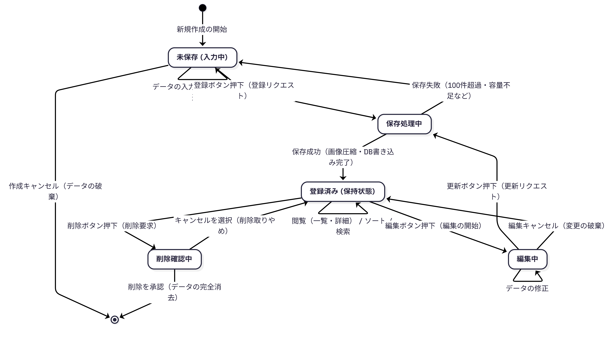

# https://csta24035.github.io/paper-airplane-app/
# paper-airplane-app
## 要件定義
### 目的
#### 個人で様々な​紙飛行機の​折り方を​個々で​記録・​保存し、​飛距離と​セットで​閲覧できるWebアプリ

### 利用者の入出力
#### 入力  
「紙飛行機の名前」(必須)文字入力数1～100文字  
「完成した紙飛行機の画像」(任意)1枚当たり10MBまでの容量制限  
「折り方（テキスト）」(任意)入力範囲0～5000文字  
「折り方（画像）」(任意)1枚当たり10MBまでの容量制限  
「折る回数」(任意)入力範囲は整数で0回～999回  
「飛距離」(任意)入力範囲0.1m～9999.9m  
「作成日」(任意)手入力で都度更新可  
「備考メモ」(任意)改行可
#### 出力  
名前  
完成した紙飛行機の画像（先頭画像のみ、画像無しならプレースホルダー表示）  
折り方  
飛距離  
折る回数  
備考メモ  
作成日  
上記を紙飛行機ごとにまとめてセットで閲覧できるように表示 

### 制約  
Webアプリのみ  
データは端末内のブラウザストレージに保存  
実装方式はIndexedDBを利用  
データはサーバーへ送信しない  
利用可能な端末はスマートフォン・タブレット・PC  
紙飛行機の名前は重複可  
飛距離はm（メートル）単位で小数点入力も可  
折る回数は手入力  
作成日は任意の日付を指定  
備考メモの文字数制限は256文字まで  
完成画像は3枚まで登録可能  
折り方画像は50枚まで登録可能  
折り方画像と折り方テキストは両方必須ではない  
データ件数は1つの端末に最大100件  
IndexedDB容量超過時には保存失敗時はエラーメッセージ表示  
ブラウザデータ削除時はデータも消失し復旧機能は提供しない  
最大件数到達時は100件で、最大まで登録済みの場合には新規登録を禁止してエラーメッセージ表示  
画像枚数超過時は完成画像4枚目以降は選択不可  
折り方画像51枚目以降は登録不可 

### 受け入れ基準
紙飛行機の登録が可能  
一覧表示が可能  
飛距離順や折る回数順でソート可能  
データが再起動後も残る  
画像付きでの閲覧が可能  
折り方を手順ごとに管理（手順1：説明テキスト・画像　手順2：説明テキスト・画像）  
一覧画面では名前・完成画像 ・飛距離・折る回数・作成日を表示。  
一覧から詳細画面へ遷移する形式  
詳細画面の表示順は名前・完成画像・飛距離・折る回数・作成日・折り方・備考メモ  
ソートは昇順・降順の両方必要  
飛距離順・折る回数順・作成日順・名前順でソート可能  
検索機能（名前検索）  
登録後の紙飛行機情報を編集可能  
削除機能  
削除時に確認ダイアログを表示  
アップロード可能な画像形式はJPGとPNG  
画像サイズに上限が無いため画像の自動リサイズや圧縮（長辺1920px以内・JPEG品質80%・PNGはリサイズのみ）が必要  
対応ブラウザはSafari・Chrome・Edge  
同時利用者は1人  
必須項目のみで登録可能  
最大件数100件まで登録可能  
登録後一覧に反映  
全項目を編集可能  
編集内容は永続  
昇順・降順を切り替え可能  
同値の場合は登録順を維持  
部分一致検索  
大文字小文字を区別しない  
0件時にメッセージ表示  
ブラウザ再起動後もデータが保持される。端末再起動後も保持される。 

### 非目標
ユーザー登録  
AIによる折り方提案  
クラウド同期  
複数ユーザー管理  
他端末との同期は対象外  
QR共有は対象外

## 4種の設計図
### ユースケース図風

図の構成要素と意図の解説
1. アクター
ユーザー（個人）: 「同時利用者は1人」「ユーザー登録や複数ユーザー管理は非目標」という要件から、アプリを操作する単一の主体として定義しています。

2. 主要なユースケース（起点）
紙飛行機を登録する: 新規作成のフローです。

一覧を表示する: アプリ起動時の基本画面となるフローです。

3. 関係性（include / extend）の定義
<< include >>（必須で実行される処理）

登録 ➔ 画像圧縮・件数チェック: 登録処理を行う際、要件にある「最大100件の制約」や「画像の自動リサイズ・圧縮」はバックグラウンドで必ず実行されるため包含関係としています。

一覧表示 ➔ 詳細表示: 一覧から詳細画面へ遷移する形式であるため、詳細の閲覧は一覧表示のフローに包含されます。

削除 ➔ 確認ダイアログ: 「削除時に確認ダイアログを表示」という受け入れ基準を満たすため、必ず発生する手順としています。

<< extend >>（任意のタイミング・条件で実行される処理）

一覧表示 ➔ ソート / 検索 / 削除: 一覧画面において、ユーザーの任意でソート（飛距離順など）や検索が行われます。また、一覧画面から直接削除アクションが行える設計も想定し、拡張関係で繋いでいます。

詳細表示 ➔ 編集 / 削除: 詳細画面を閲覧した上で、任意で内容を更新（編集）したり、削除したりするアクションを定義しています

### クラス図

図の設計意図とポイント解説
1. クラス設計
PaperAirplane (紙飛行機): アプリケーションのコアとなるエンティティです。入力要件に合わせた属性（名前、飛距離、作成日など）とデータ型を定義しています。

FoldingStep (折り方手順): 「折り方を手順ごとに管理」という要件を満たすため、紙飛行機本体から切り離して独立したクラスにしています。

ImageBase (画像抽象クラス) と継承: 「完成画像」と「折り方手順画像」は共通のプロパティ（データ本体、フォーマットなど）を持つため、親クラスである ImageBase を定義し、CompletedImage と StepImage がそれを継承する設計にしました。

IndexedDBManager: ブラウザストレージの操作をカプセル化したクラスです。検索、ソート、最大100件の容量チェックなどの操作（メソッド）を持ちます。

ImageProcessor: 長辺1920pxへのリサイズやJPEG品質80%への圧縮など、画像処理の要件を担うユーティリティクラスです。

2. クラス間の関連と多重度
コンポジション（黒いひし形 *--）: 親が削除されたら子も削除される「強い結びつき」です。紙飛行機が削除されれば完成画像や折り方手順も不要になるため、この関係を使用しています。多重度を用いて「完成画像は0～3枚まで（"0..3"）」「手順は0～50まで（"0..50"）」「各手順には画像が0～1枚（"0..1"）」という制約を明示しました。

集約（白いひし形 o--）: IndexedDBの管理クラスが複数の紙飛行機データ（0～100件）を保持している関係を表しています。

依存（点線矢印 ..>）: データ保存前に画像を圧縮するため、データベース管理クラスが画像処理クラスを利用（依存）していることを表しています。

### シーケンス図
紙飛行機の登録フロー

紙飛行機の削除フロー

図のポイント解説  
4層アーキテクチャの分離

画面(UI): ユーザーとの直接的なやり取り（入力の受け付け、ダイアログ表示、画面遷移）を担当します。

コントローラ: ビジネスロジック（上限チェックの判断、画像のリサイズ・圧縮の実行）を担当し、UIとDBの橋渡しをします。

モデル(IndexedDB): 実際のデータの永続化や、現在の登録件数のカウントなど、データの直接的な操作を担当します。

loop（繰り返し）: 登録フローにて、ユーザーが添付した画像の枚数分だけ（完成画像最大3枚＋手順画像最大50枚）、画像の最適化処理を繰り返す構造にしています。

alt（条件分岐）: 登録フローでは「登録件数が100件に達しているかどうか」、削除フローでは「確認ダイアログでユーザーがどちらを選択したか」による処理の分岐を明確にしています。

### 状態遷移図

図の設計意図とポイント解説
1. 状態の定義
[*]（初期状態 / 終了状態）: 黒い丸で表現されるシステム外の状態です。データが存在しない状態から始まり、最終的に削除されてシステムから消滅するまでのライフサイクルを示します。

未保存（入力中）: ユーザーが新規フォームに名前や画像をセットしている段階です。この時点ではまだブラウザのストレージ（IndexedDB）には保存されていません。

保存処理中: 登録や更新がリクエストされ、システムがバックグラウンドで「画像の自動圧縮（リサイズ等）」や「最大100件の制約チェック」を行っている過渡的な状態です。

登録済み（保持状態）: IndexedDBにデータが正常に保存され、安定している状態です。この状態のまま、一覧表示、詳細表示、ソート、検索などの操作が行われます。

編集中 / 削除確認中: 既存データに対してユーザーが変更を加えようとしている、あるいは削除の最終確認を行っている状態です。

2. トリガー（イベント）と遷移の制御
保存失敗のループ: 要件にある「最大件数100件」「容量超過時はエラーメッセージ表示」という制約を表現するため、保存処理中 から 未保存 に戻る遷移（保存失敗のフォールバック）を明示しています。

編集から保存への共通化: 新規作成時だけでなく、編集中に更新をリクエストした際も同様に 保存処理中 ステートを経由させることで、画像圧縮や容量チェックの処理が共通して走る設計意図を反映しています。

キャンセルの担保: ユーザーの誤操作を防ぐため、入力中や編集中、削除確認の各状態から「キャンセル」をトリガーにして安全な状態へ戻る、もしくは破棄される遷移を設けています。