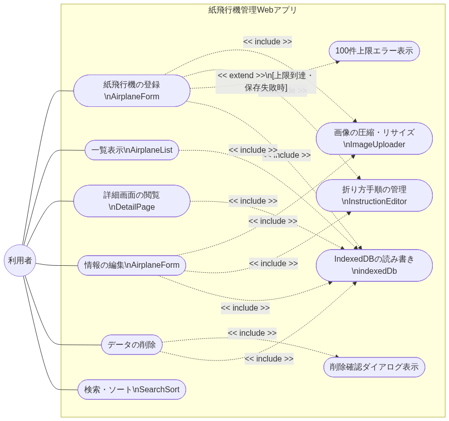
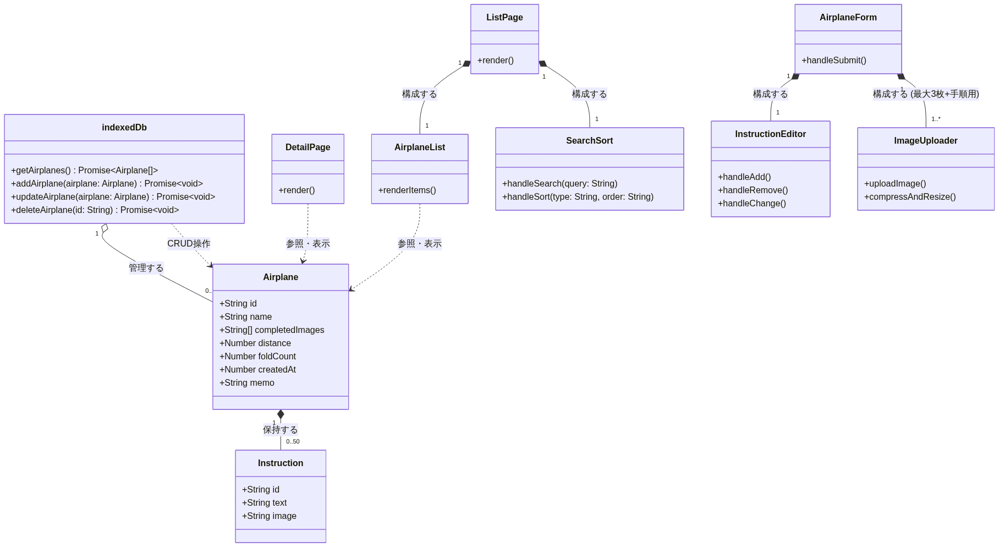
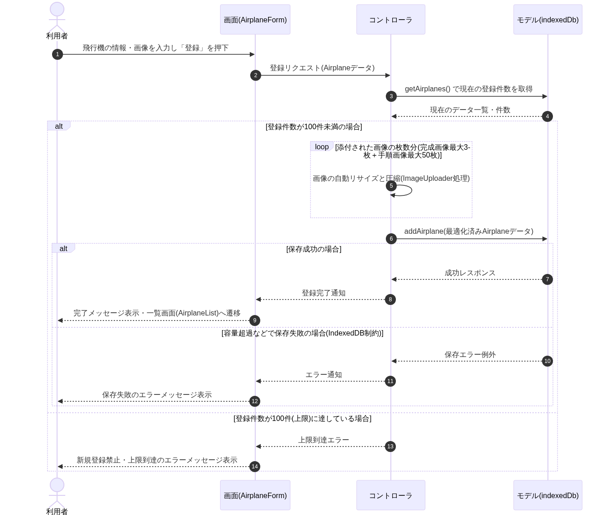
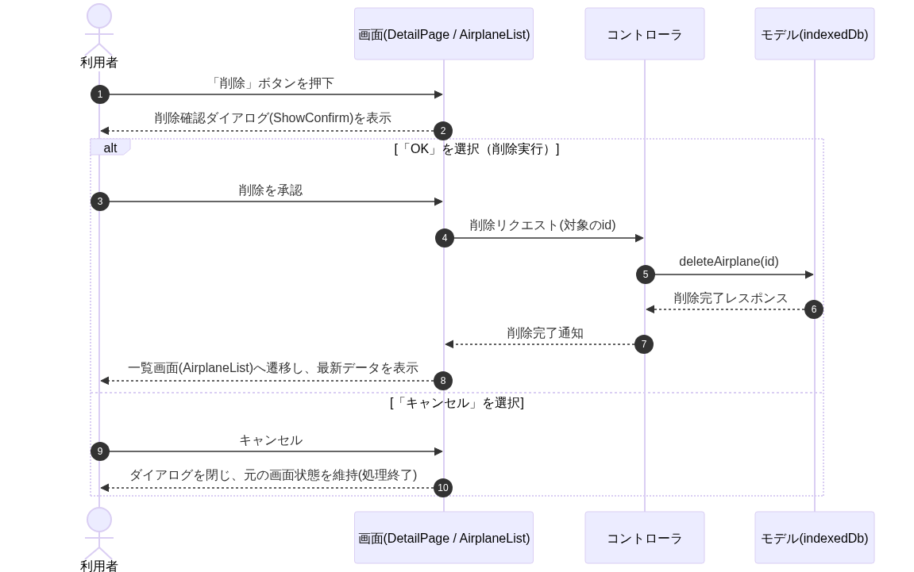
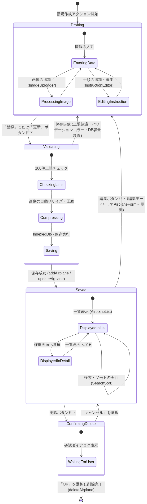

# 起動方法　https://csta24035.github.io/paper-airplane-app/
# paper-airplane-app
## 要件定義
### 目的
#### 個人で様々な​紙飛行機の​折り方を​個々で​記録・​保存し、​飛距離と​セットで​閲覧できるWebアプリ

### 利用者の入出力
#### 入力  
「紙飛行機の名前」(必須)文字入力数1～100文字  
「完成した紙飛行機の画像」(任意)1枚当たり10MBまでの容量制限  
「折り方（テキスト）」(任意)入力範囲0～5000文字  
「折り方（画像）」(任意)1枚当たり10MBまでの容量制限  
「折る回数」(任意)入力範囲は整数で0回～999回  
「飛距離」(任意)入力範囲0.1m～9999.9m  
「作成日」(任意)手入力で都度更新可  
「備考メモ」(任意)改行可
#### 出力  
名前  
完成した紙飛行機の画像（先頭画像のみ、画像無しならプレースホルダー表示）    
飛距離  
折る回数  
作成日  
折り方  
備考メモ
上記を紙飛行機ごとにまとめてセットで閲覧できるように表示 

### 制約  
Webアプリのみ  
データは端末内のブラウザストレージに保存  
実装方式はIndexedDBを利用  
データはサーバーへ送信しない  
利用可能な端末はスマートフォン・タブレット・PC  
紙飛行機の名前は重複可  
飛距離はm（メートル）単位で小数点入力も可  
折る回数は手入力  
作成日は任意の日付を指定  
備考メモの文字数制限は256文字まで  
完成画像は3枚まで登録可能  
折り方画像は50枚まで登録可能  
折り方画像と折り方テキストは両方必須ではない  
データ件数は1つの端末に最大100件  
IndexedDB容量超過時には保存失敗時はエラーメッセージ表示  
ブラウザデータ削除時はデータも消失し復旧機能は提供しない  
最大件数到達時は100件で、最大まで登録済みの場合には新規登録を禁止してエラーメッセージ表示  
画像枚数超過時は完成画像4枚目以降は選択不可  
折り方画像51枚目以降は登録不可 

### 受け入れ基準
紙飛行機の登録が可能  
一覧表示が可能  
データが再起動後も残る  
画像付きでの閲覧が可能  
折り方を手順ごとに管理（手順1：説明テキスト・画像　手順2：説明テキスト・画像）  
一覧画面では名前・完成画像 ・飛距離・折る回数・作成日を表示。  
一覧から詳細画面へ遷移する形式  
詳細画面の表示順は名前・完成画像・飛距離・折る回数・作成日・折り方・備考メモ  
ソートは昇順・降順の両方必要  
飛距離順・折る回数順・作成日順・名前順でソート可能  
検索機能（名前検索）  
登録後の紙飛行機情報を編集可能  
削除機能  
削除時に確認ダイアログを表示  
アップロード可能な画像形式はJPGとPNG  
画像サイズに上限が無いため画像の自動リサイズや圧縮（長辺1920px以内・JPEG品質80%・PNGはリサイズのみ）が必要  
対応ブラウザはSafari・Chrome・Edge・Brave  
同時利用者は1人  
必須項目のみで登録可能  
最大件数100件まで登録可能  
登録後一覧に反映  
全項目を編集可能  
編集内容は永続  
昇順・降順を切り替え可能  
同値の場合は登録順を維持  
部分一致検索  
大文字小文字を区別しない  
0件時にメッセージ表示  
ブラウザ再起動後もデータが保持される。端末再起動後も保持される。 

### 非目標
ユーザー登録  
AIによる折り方提案  
クラウド同期  
複数ユーザー管理  
他端末との同期は対象外  
QR共有は対象外

## 4種の設計図
### ユースケース図風

#### 図のポイント解説  
アクター: システムを利用する「利用者（User）」を定義し、主要なユースケースに実線（---）で繋いでいます。同時利用者は1人という要件に基づき、アクターは1種類のみです。

<< include >> (包含関係):

登録（AirplaneForm）や編集時には、要件にある「画像の自動リサイズ・圧縮（ImageUploader）」や「手順の管理（InstructionEditor）」が必須プロセスとして組み込まれるため、include で繋いでいます。

削除実行時の「確認ダイアログ表示」も要件として必須のため include としています。

全てのデータ操作（登録、表示、編集、削除）は、IndexedDB（indexedDb）を介して行われるため、データ永続化処理を包含しています。

<< extend >> (拡張関係):

「100件到達時」や「IndexedDB容量超過時」という特定の条件を満たした場合のみエラーメッセージの表示が行われるため、登録処理からの extend（拡張）として表現しています。

### クラス図

#### クラス図のポイント  
データモデルの分離：要件で規定されているデータ（名前、完成画像最大3枚、飛距離、折る回数、作成日、備考メモ）を Airplane クラスに定義し、0〜50個作成される手順を Instruction クラスに切り出しました。これらは コンポジション（黒いひし形 *--）で結びつけています。

多重度の明記：Airplane と Instruction の間には "1" *-- "0..50"（1つの紙飛行機に対して折り方は最大50件）を定義。

indexedDb と Airplane の間には "1" o-- "0..100"（DB内に保存できる紙飛行機データは最大100件）を定義し、集約（白いひし形 o--）を用いています。

UIとロジックの依存関係：ListPage や AirplaneForm 等のUIコンポーネントが、それぞれ子コンポーネント（SearchSort や ImageUploader など）を内包する形で表現しています。画像自動リサイズと圧縮の要件は ImageUploader の操作として定義しました。

### シーケンス図
紙飛行機の登録フロー

紙飛行機の削除フロー

#### 図のポイント解説  
4層アーキテクチャの分離：画面(UI): AirplaneForm や DetailPage など、ユーザー入力を受け付け、表示を担当。

コントローラ：上限件数の判定や、ImageUploader に相当する画像処理ロジックなど、ビジネスルールを担当。

モデル(DB)：indexedDb を介した実際のデータの読み書き、永続化を担当。

loop（繰り返し）：登録フロー（図1のNo.5〜6）にて、ユーザーが添付した画像の枚数分だけ、画像最適化処理（長辺1920px以内、JPEG80%等）を繰り返す構造にしています。

alt（条件分岐）：登録フローでは「登録件数が100件に達しているかどうか」による全体分岐と、その内部での「IndexedDBの容量超過により保存に失敗したか」のネストされた分岐を実装しています。
削除フローでは「確認ダイアログでユーザーがOK/キャンセルのどちらを選択したか」による処理の分岐を表現しています。

### 状態遷移図

#### 図のポイント解説  
初期状態 ([*]) と終了状態 ([*])

初期状態から新規作成を開始することで、データの入力状態（Drafting）へ遷移します。

削除確認ダイアログで「OK」を選択し、indexedDb からデータが完全に削除された時点が終了状態（ライフサイクルの終わり）となります。

Drafting（入力・編集状態）

AirplaneForm 上での状態です。基本情報の入力（EnteringData）を中心に、画像の添付（ImageUploader）や手順の追加（InstructionEditor）を行き来する内部状態を持たせています。

Validating（検証・保存処理状態）

ユーザーが保存を試みた際の一時的な状態です。要件にある「最大100件の上限チェック」「画像の圧縮・リサイズ」「DBへの保存」の順に処理が進みます。

エラー（件数上限や容量超過）が発生した場合は、元の入力状態（Drafting）に差し戻され、エラーメッセージが表示される遷移（トリガー）を表現しています。

Saved（保存済み状態）

indexedDb に永続化された状態です。AirplaneList での一覧表示や、DetailPage での詳細表示の間の遷移を行います。

SearchSort による検索・ソートは、一覧表示状態（DisplayedInList）における自己遷移として表現しています。

ここから「編集」をトリガーとして Drafting に戻るか、「削除」をトリガーとして ConfirmingDelete へ進む分岐が発生します。